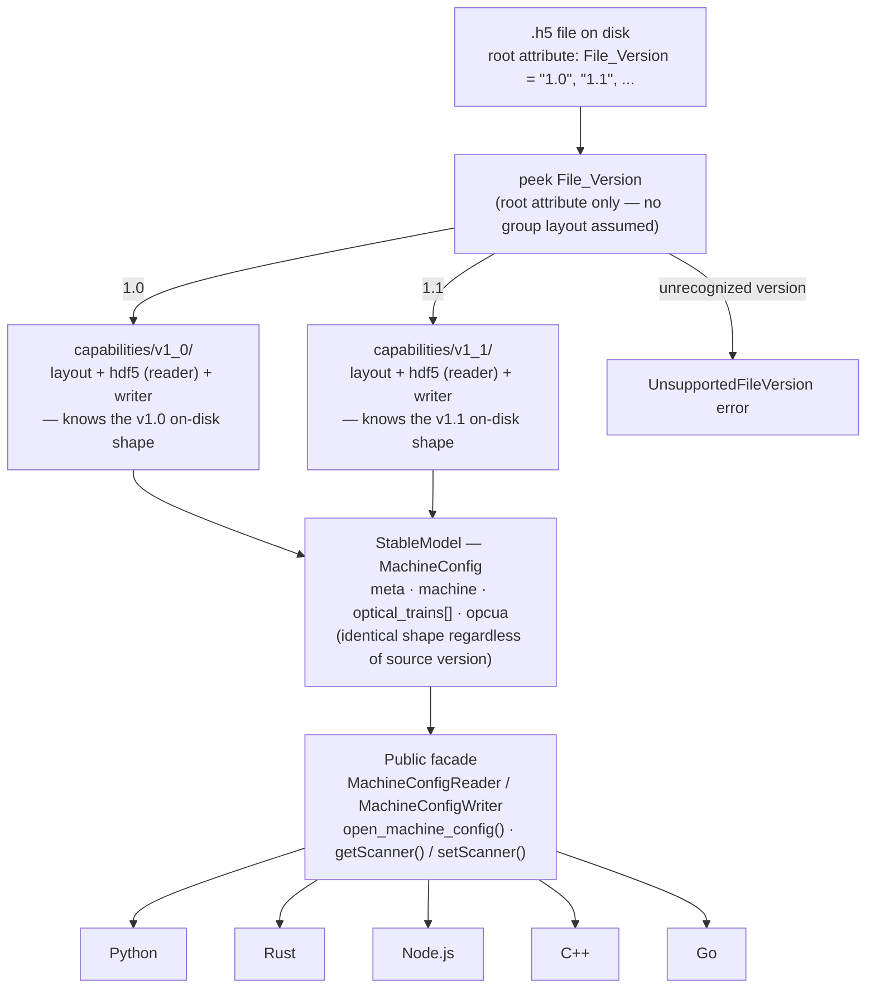
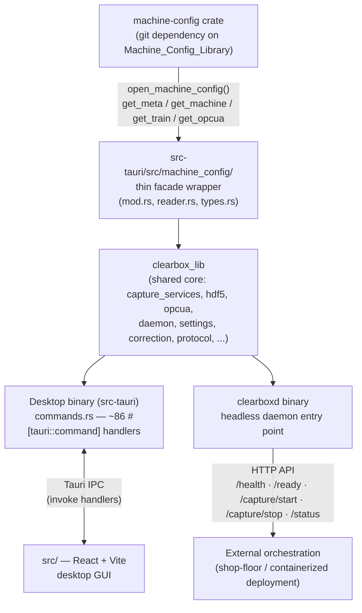
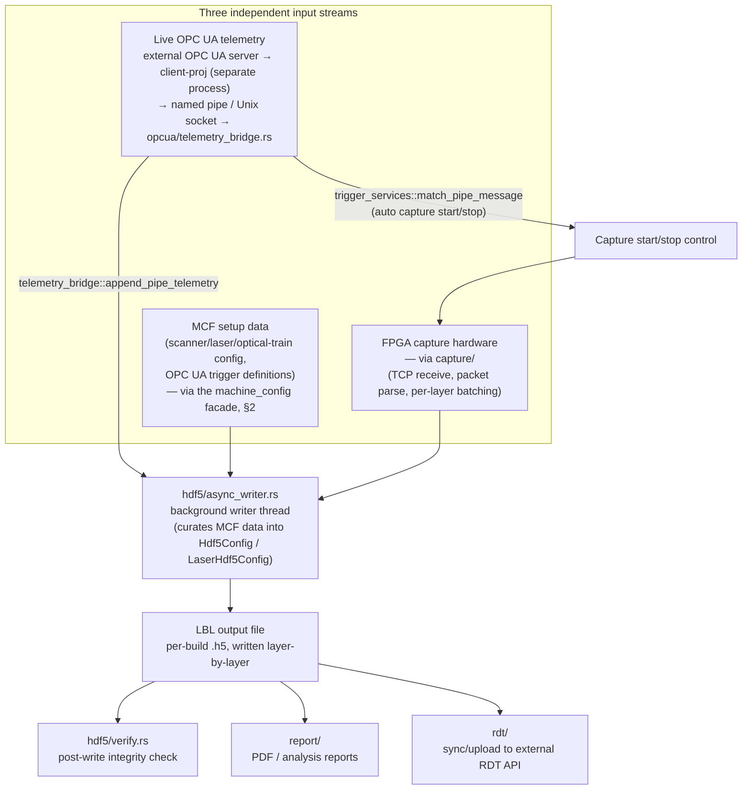
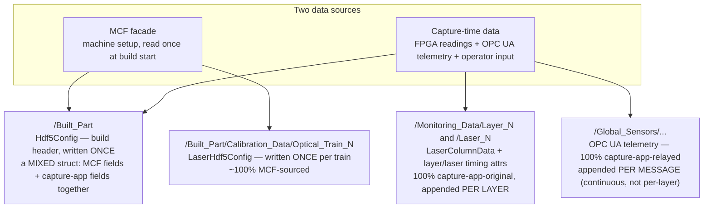
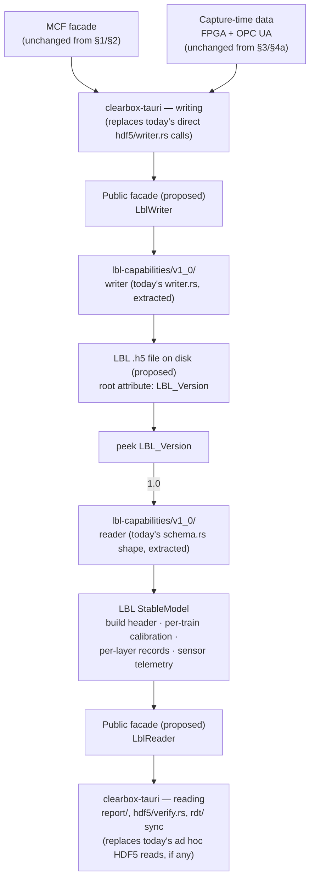

# Architecture Overview — MCF and clearbox-tauri

**Purpose:** a small set of diagrams answering three questions, in order:

1. How does the Machine Config Library (MCF) itself absorb a new on-disk file version without
   breaking its public API?
2. How does an outside consumer application — `clearbox-tauri`, the ClearBox capture
   software — integrate with that public API?
3. How do MCF's setup data, the capture software's own inputs, and live OPC UA telemetry
   combine to produce that application's final output file (the "LBL")?

Each section is written to stand alone, and the boundary between sections 1 and 2 is
deliberately also *where the two projects actually meet* — MCF ends at its public facade;
everything past that facade belongs to clearbox-tauri.

**Scope note:** this file lives in `Machine_Config_Library` but documents the relationship
between two separate repositories: this one, and `clearbox-tauri` (a Tauri desktop capture
application, at a sibling path on disk — not a subdirectory of this repo). Facts about
`clearbox-tauri` below were gathered by reading that repository directly (file/line citations
given where practical) as of **2026-09-11** — re-verify against its current source before relying
on this for anything load-bearing; it will drift as both projects evolve independently.

← Back to [USAGE.md](../USAGE.md)

---

## Contents

- [1. MCF: how a file version becomes the public API](#1-mcf-how-a-file-version-becomes-the-public-api)
- [2. clearbox-tauri: how it consumes that public API](#2-clearbox-tauri-how-it-consumes-that-public-api)
- [3. The full pipeline: MCF + capture + OPC UA → LBL](#3-the-full-pipeline-mcf--capture--opc-ua--lbl)
- [4. The MCF/capture boundary inside the LBL, and a future LBL library](#4-the-mcfcapture-boundary-inside-the-lbl-and-a-future-lbl-library)
  - [4a. Today: which LBL fields come from where](#4a-today-which-lbl-fields-come-from-where-current-state-verified)
  - [4b. Proposed: an LBL library mirroring MCF's design](#4b-proposed-an-lbl-library-mirroring-mcfs-design-future-state)
- [Glossary](#glossary)
- [Sources](#sources)

---

## 1. MCF: how a file version becomes the public API

MCF's central design commitment (see `USAGE.md`'s "Capability API" section and
`docs/contributing.md`'s "File_Version adapters" section) is that **no application ever branches
on file version**. A `.h5` file's on-disk layout can change between versions; the public model
it maps to does not.

**Reading this diagram:**
- The only version-aware code in the entire library is the adapter dispatch step (`peek
  File_Version` → pick a `capabilities/vX_Y/` folder). Every adapter folder is independently
  responsible for its own on-disk group/attribute layout — v1.0 and v1.1 never share layout code,
  only the StableModel shape they both produce.
- **Adding a hypothetical v1.2** means adding a new `capabilities/v1_2/` folder and a registry
  entry — v1.0 and v1.1's adapters, and everything above the `StableModel` line in this diagram,
  are untouched (`docs/contributing.md`'s "Adding a new file version" checklist governs this).
- All five language implementations (Python, Rust, Node.js, C++, Go) independently implement this
  same shape — same dispatch logic, same StableModel field names, verified identical by
  `tools/cross_check.py` (see `docs/contributing.md`).
- This is exactly the boundary an application like clearbox-tauri consumes: it only ever talks to
  the "Public facade" box. Everything above that line in this diagram is invisible to it.

---

## 2. clearbox-tauri: how it consumes that public API

`clearbox-tauri` is a separate Tauri desktop application (Rust backend + web frontend) for the
same LPBF/metal-3D-printing machines MCF describes. It depends on MCF as an ordinary Rust crate
(`git` dependency in `src-tauri/Cargo.toml`) and reads machine setup data through MCF's public
facade — never raw HDF5.

**Reading this diagram:**
- **This is the boundary from §1's diagram, continued** — "Public facade" there is the same box
  as "machine-config crate" here. clearbox-tauri never sees `File_Version`, never picks an
  adapter, never touches HDF5 groups directly for MCF-owned data.
- `src-tauri/src/machine_config/` used to be a hand-rolled HDF5 reader; it is now a thin wrapper
  around MCF's facade (per that module's own header comment referencing
  `docs/MCF_INTEGRATION_PLAN.md` on the clearbox-tauri side). It still hand-parses exactly two
  HDF5 groups MCF deliberately doesn't cover (`/Configuration/build_configuration`,
  `/Configuration/sensor_configurations`) — legacy, out-of-schema data, not a gap in the MCF
  integration itself.
- **Two consumption surfaces, one shared core**: the desktop app (Tauri commands + a React/Vite
  frontend talking over Tauri's IPC) and `clearboxd` (a separate binary in the same Cargo
  workspace, built from the same core library with `--features headless`, exposing an HTTP API
  instead) are two entry points into identical underlying logic — not two separate
  implementations to keep in sync.
- `capture_services/` (capture setup, e.g. deciding scanner/laser parameters for a run) is driven
  directly by the MCF-sourced config, alongside the command/daemon surfaces shown above.

---

## 3. The full pipeline: MCF + capture + OPC UA → LBL

"LBL" is clearbox-tauri's own term for its **output** artifact — a per-build HDF5 file recording
what actually happened during a print, layer by layer. It is conceptually MCF's mirror image:
MCF is machine *setup* data (input); LBL is build *history* data (output). clearbox-tauri's own
docs describe a future dedicated "LBL library," explicitly modeled on MCF's own design.

Three independent input streams converge to produce it:

**Reading this diagram:**
- **MCF's role here is read-once, upstream**: setup data (which laser, which scanner offsets,
  which OPC UA triggers are defined) is loaded through the facade from §2 and curated into the
  writer's own internal config shape — MCF itself has no idea a capture or an LBL file exists.
- **OPC UA has a dual role**: the same telemetry stream both (a) can automatically start/stop a
  capture based on trigger rules defined in the MCF file's `opcua` config, and (b) is itself
  recorded into the LBL file as telemetry data. clearbox-tauri's Rust code is not the OPC UA
  *client* — a separate external process (`client-proj`) holds that connection and relays
  telemetry in over a pipe/socket; clearbox-tauri's side is the pipe *server*/consumer.
- **The actual convergence point** is `hdf5/async_writer.rs` — the one place all three streams
  meet before anything is written to disk.
- Downstream of the LBL file itself: integrity verification, PDF/analysis reporting, and
  optional sync to an external system — all read-only consumers of the finished file, not part
  of producing it.

---

## 4. The MCF/capture boundary inside the LBL, and a future LBL library

§3 showed *that* three streams converge into the LBL. This section shows, concretely,
**which actual fields** in the LBL file come from MCF versus from the capture application
itself — and then sketches how a future, standalone LBL library (mirroring MCF's own design)
might sit on top of that same boundary.

### 4a. Today: which LBL fields come from where (current state, verified)

This is not speculative — it describes `clearbox-tauri`'s actual, shipped
`src-tauri/src/hdf5/writer.rs`/`schema.rs` as of 2026-09-11 (see Sources). The LBL's real
top-level shape is `/Built_Part` (+ `/Built_Part/Calibration_Data`) → `/Monitoring_Data/Layer_N`
→ `/Laser_N/{...}`, plus `/Global_Sensors` for OPC UA telemetry.

**Reading this diagram:**
- **`/Built_Part`'s header is not cleanly one-source** — it's a single struct (`Hdf5Config`) that
  interleaves MCF-sourced fields (`machine_serial`, `alloy`, `build_plate_x/y/z`,
  `gas_flow_direction`, `recoater_blade_type`, …) with capture-app-original build metadata
  (`build_id`, `operator`, `total_layers`, `protocol`, bit resolutions, `sample_period`) into one
  write call. This is the one place the two sources are genuinely mixed field-by-field, not
  cleanly separated by group.
- **Per-optical-train calibration is essentially pure MCF** — scanner serial number, axis bit
  resolutions, light-source wavelength/power, and the correction-data grids all trace straight
  back to `machine_config::OpticalTrain`, copied once per train.
- **Per-layer data is entirely capture-app-original** — laser state/power, commanded vs. actual
  X/Y/Z position, per-layer timing. MCF has no concept of a "layer" at all; this data doesn't
  exist anywhere upstream of the capture app.
- **OPC UA telemetry is its own third granularity** — not a one-time snapshot like the header,
  and not cleanly per-layer like the position data either. It's appended continuously,
  per-message, and only *tagged* to a layer/Z-height when the message happens to carry that
  context (untagged records land in an `.../unassigned` bucket).
- **The snapshot/per-layer split is directional, not absolute** — real counter-examples exist on
  both sides: `Layer_Quantity` (capture-original) is written once, then updated exactly once more
  when the build closes, not per-layer; `Build_Status` (capture-original) is a one-time flag
  flipped at the end; the correction-data grids (MCF-sourced) are sent as their own one-time
  writes, separate from the header, but still snapshot-granularity, not per-layer.

**Concrete field examples** (real identifiers from the source, grouped by location and source):

| LBL location | Written | Source | Example fields |
|---|---|---|---|
| `/Built_Part` (header) | once | **MCF** | `machine_serial`, `alloy`, `material_id`, `build_plate_x/y/z` (+unit), `build_plate_corner_radius`, `gas_flow_direction`, `recoat_direction`, `recoater_blade_type` |
| `/Built_Part` (header) | once | **Capture app** | `build_id`, `operator`, `total_layers`, `protocol`, `actual_bit_resolution`, `commanded_bit_resolution`, `sample_period`, `laser_count` |
| `/Built_Part/Calibration_Data/Optical_Train_N` | once per train | **MCF (~100%)** | scanner `serial_number`, `x/y_axis` bit resolutions, `light_wavelength`, `power_min/max_nominal/actual`, `volts_to_watts_algorithm`, `correction_data`/`inverse_correction_data` grids |
| `/Monitoring_Data/Layer_N`, `/Laser_N` | per layer | **Capture app (100%)** | `Start_Layer_Time`, `End_Layer_Time`, `laser_state`, `laser_power`, `commanded_x/y/z`, `actual_x/y/z`, `complete` |
| `/Global_Sensors/{run,task,sensor}_events/…` | per message | **Capture app (100%, OPC UA-relayed)** | `Value`, `Source_ts`, `ZHeight`, `DataType` |

### 4b. Proposed: an LBL library mirroring MCF's design (future state)

**Nothing below this line exists yet.** Today, `writer.rs`/`schema.rs` above *are* effectively an
embryonic single-version LBL format, hand-written directly inside `clearbox-tauri`. The proposal
is to extract that into its own standalone library — versioned, with a public facade — the same
shape as §1's MCF diagram, so that clearbox-tauri stops owning HDF5-layout logic directly, the
same way it already stopped owning MCF-reading logic once it adopted the `machine-config` crate.

**Reading this diagram:**
- **Same shape as §1, deliberately** — `LBL_Version` plays the same role `File_Version` plays for
  MCF: the one piece of version-aware dispatch logic, isolated from everything downstream of it.
  `docs/contributing.md`'s "Adding a new file version" playbook (schema/adapter/tests) would apply
  to this hypothetical library the same way it applies to MCF today.
- **The inputs don't change — only the packaging does.** §4a's two sources (MCF facade,
  capture-time data) still feed the write path exactly as they do today; what changes is that
  `clearbox-tauri` would call a versioned `LblWriter` instead of `writer.rs`'s functions directly,
  and the mixed-field `Hdf5Config` header struct would presumably get split cleanly into
  distinct MCF-sourced vs. capture-original sub-models on the far side of that facade.
- **This would give the LBL format the same benefit MCF already gives clearbox-tauri**: a future
  LBL layout change (e.g. restructuring `/Global_Sensors`) becomes a new `lbl-capabilities/v1_1/`
  folder, not a rewrite of every place in `clearbox-tauri` that reads or writes an LBL file.
- Whether this becomes a genuinely separate repository/package (like MCF is to clearbox-tauri
  today) or an internal module within `clearbox-tauri` restructured to look like one is an open
  decision this diagram deliberately doesn't take a position on.

---

## Glossary

| Term | Meaning |
|---|---|
| **MCF** | Machine Config (File/Format) — this repository; describes machine *setup* (scanner, laser, optical train). Input to a build. |
| **File_Version** | The on-disk `.h5` layout version MCF itself reads/writes (`"1.0"`, `"1.1"`, …) — the adapter-selection key from §1. Unrelated to either project's package/release version. |
| **StableModel** | MCF's version-agnostic in-memory shape (`MachineConfig`) — what every adapter produces and what the public facade returns. |
| **LBL** | clearbox-tauri's own term for its output artifact — a per-build HDF5 "build log," written layer-by-layer during capture. Not an MCF concept; MCF is one of its inputs. |
| **`clearboxd`** | clearbox-tauri's headless daemon binary — same core logic as the desktop app, HTTP API instead of a GUI, for shop-floor/container deployment. |
| **`client-proj`** | The separate external process that holds the actual OPC UA client connection and relays telemetry into clearbox-tauri over a pipe/socket. |
| **`LBL_Version`** | Proposed (§4b, not implemented) — the LBL-equivalent of `File_Version`: a hypothetical future on-disk version marker for a standalone LBL library, dispatching to its own `lbl-capabilities/vX_Y/` adapters the same way MCF's `File_Version` does today. |

---

## Sources

**MCF (§1):** this repository — `USAGE.md`'s "Capability API" section, `docs/contributing.md`'s
"File_Version adapters" and "Adding a new file version" sections, and this session's own
first-hand knowledge of `schema/`, `*/capabilities/v1_0/`, `*/capabilities/v1_1/` across all five
language implementations.

**clearbox-tauri (§2, §3):** gathered via a read-only investigation pass against
`C:\Users\ChrisParham\Desktop\Repo\clearbox-tauri` on 2026-09-11. Key citations:
- MCF dependency: `src-tauri/Cargo.toml` (git dependency on this repository)
- Facade usage: `src-tauri/src/machine_config/reader.rs` (`open_machine_config`, `get_meta`,
  `get_machine`, `get_train`, `get_opcua`), `src-tauri/src/machine_config/mod.rs` (header comment
  referencing that project's own `docs/MCF_INTEGRATION_PLAN.md`)
- Command surface: `src-tauri/src/commands.rs`, `lib.rs` (`generate_handler!`)
- `clearboxd`: `clearboxd/Cargo.toml`, `clearboxd/src/main.rs`, workspace root `Cargo.toml`
- OPC UA pipeline: `docs/OPC UA/OPCUA_SUBSYSTEM.md`, `src-tauri/src/opcua/*`,
  `src-tauri/src/daemon/opcua_routes.rs`
- LBL terminology: `docs/MCF_INTEGRATION_PLAN.md`, `docs/OPC UA/OPCUA_SUBSYSTEM.md`,
  `documentation/PROJECT_OVERVIEW.md` (all within `clearbox-tauri`)
- Writer/convergence: `src-tauri/src/hdf5/writer.rs`, `src-tauri/src/hdf5/async_writer.rs`

**§4a's field-level provenance** was gathered via a second, more targeted read-only pass focused
specifically on `src-tauri/src/hdf5/writer.rs` and `schema.rs`, on 2026-09-11. Key citations:
- `Hdf5Config` struct and header fields: `writer.rs:125-173`; written once via
  `write_full_configuration` (`writer.rs:710`)
- MCF-to-header field curation: `capture_services/mod.rs:249-290`, `:326-374`, routed through the
  app-local `MachineMeta` struct (`pipeline.rs:207-218`)
- `LaserHdf5Config` struct: `writer.rs:30-121`; built by `build_laser_hdf5_config`
  (`pipeline.rs:1518`) from `capture_services/mod.rs:616-689`
- Correction-data one-time writes: `write_correction_data_raw`/`write_inverse_correction_data_raw`
  (`writer.rs:1262`/`1299`)
- `LaserColumnData` (per-layer FPGA data): `writer.rs:217-234`
- Per-layer vs. snapshot dispatch: `Hdf5WriteCommand` enum, `async_writer.rs:63-144`
- `Layer_Quantity`/`Build_Status` one-time-not-per-layer counter-examples:
  `writer.rs:110`, `:1659-1688`, `:741`, `:1825`
- OPC UA telemetry write path: `opcua/telemetry_bridge.rs:7` (`append_pipe_telemetry`) →
  `async_writer.rs:48-60` (`TelemetryMsg`) → `writer.rs:1696` (`append_opcua_batch`),
  `:1736` (`resolve_leaf`), `:1795` (`write_leaf_attrs`), `:1879`/`:1899` (extendable-dataset
  append helpers)
- Existing internal LBL layout doc: `src-tauri/src/hdf5/schema.rs:6-24` (doc comment) — note this
  comment predates `Calibration_Data` and `Global_Sensors`, which exist in `writer.rs` but aren't
  reflected there; treat `writer.rs` itself as more current than that comment.

This is a snapshot, not a live link between the two repositories — nothing enforces that this
document stays in sync with either codebase. Re-verify the citations above before treating this
as authoritative for anything beyond a high-level orientation.
