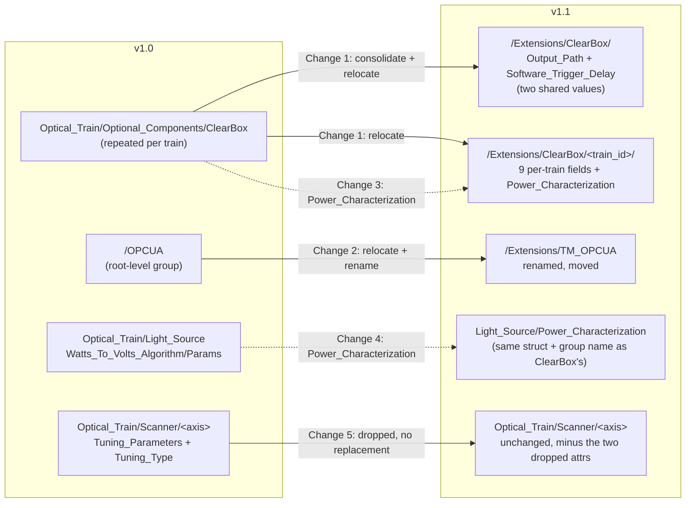
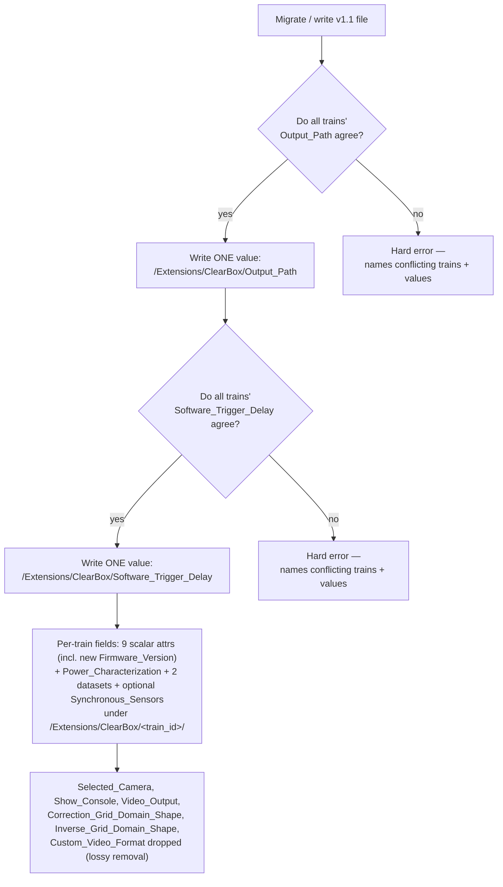
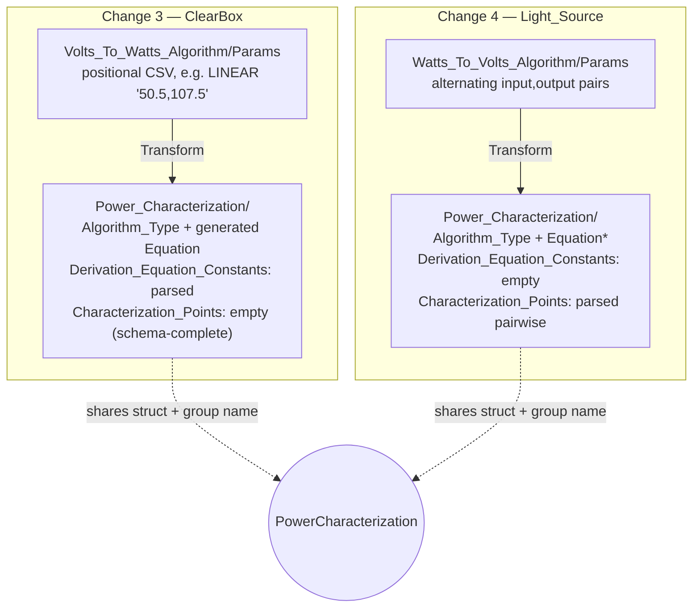
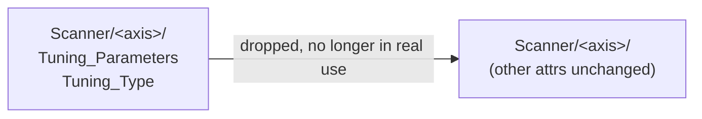

# v1.0 → v1.1 migration — diagrams

Reference diagrams for [`v1_0_to_v1_1.md`](v1_0_to_v1_1.md), cross-checked against
`reference_config_opcua_synchronous_sensors.h5` (v1.0 baseline) and
`reference_config_v1_1_review.h5` (changes 1–5, generated by
`build_v1_1_review_file.py`). Promoted alongside the manifest from
`file_testing/` on 2026-09-01 — see the manifest's status note for the
implementation history.

**Revision note:** an earlier version of this file also diagrammed a
"Change 5" (`Light_Source_Power_Readings_As_Found`/`As_Left`, with three
named scenarios and dedicated `scenario1/2/3.h5` sample files). That change
was decided against and removed from the manifest — the former §5 below was
removed along with it. The manifest has since reused the freed-up "Change 5"
number for a new, unrelated change (`Tuning_Parameters`/`Tuning_Type` dropped
from every Scanner axis group), diagrammed below in §5 — do not confuse the
two. Every diagram here also reflects the renames applied to Changes 3–4
(`Power_Calibration` → `Power_Characterization`, `Calibration_Points` →
`Characterization_Points`) and the additional attribute moves added to
Change 1 (`Software_Trigger_Delay` consolidated, four attributes removed,
`Firmware_Version` added).

## 1. Overview — where things move

## 2. Change 1 — ClearBox consolidate + relocate

`Optional_Components` disappears entirely (it only ever held ClearBox); most
other fields just change group path. `Output_Path` and `Software_Trigger_Delay`
are each consolidated across trains — disagreement in either is a hard error,
not a silent pick. Four attributes (`Video_Output`,
`Correction_Grid_Domain_Shape`, `Inverse_Grid_Domain_Shape`,
`Custom_Video_Format`) are dropped as no longer in real use; one
(`Firmware_Version`) is newly added.

## 3. Change 2 — OPCUA relocate + rename

Purely mechanical: the whole subtree moves as a unit, nothing inside it changes shape.

## 4. Changes 3 & 4 — scalar params replaced by structured characterization

Both reuse the same new `PowerCharacterization` struct **and the same group
name** (`Power_Characterization`), even though they live at different HDF5
paths and populate different StableModel fields — deliberate, since both
represent the identical concept applied to two different devices. The source
data is inverted between them: Change 3 has fit coefficients and no raw
points; Change 4 has raw points and no fit coefficients.

*`Algorithm_Equation` is generated for `LINEAR`; left blank for migrated `POLYNOMIAL` records (a human fills it in later).

## 5. Change 5 — Scanner axis attrs dropped

Pure removal, applied identically to every axis group present on a train
(`X_Axis`/`Y_Axis` always; `Z_Axis`/`Focus` when present) — no relocation,
no replacement value.

